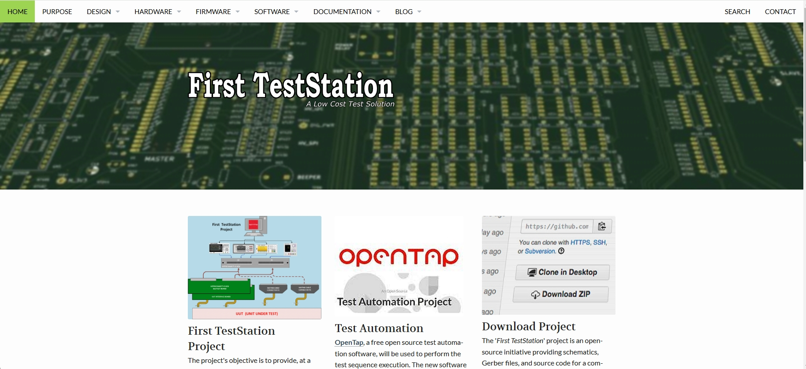

# First TestStation Website

This website showcases the First Test Station project, including its hardware, software, and mechanical assembly. It serves as a hub for sharing project details, images, and GitHub repositories. project ([FTS](https://dlock8.github.io/FTS_Website/))

## Table of Contents
1. [About the Website](#about-the-website)
2. [Features](#features)
3. [How to Use](#how-to-use)
4. [Repository Overview](#repository-overview)
5. [Contributing](#contributing)
6. [License](#license)

## About the Website

The First TestStation project is a comprehensive solution for automating the testing and validation of electronic devices and PCBs during production.  
Designed with flexibility in mind, it integrates custom hardware, firmware, and mechanical assemblies to provide an efficient and cost-effective testing process.

•	Purpose: To document and showcase the First Test Station project. 
•	Technology: Built using Jekyll, HTML, CSS, and hosted on GitHub Pages. 
•	Audience: Engineers, developers, or anyone interested in the project. 

## Features

The website is designed to provide an engaging and informative experience for users exploring the First TestStation project. Key features include:

- **Comprehensive Photo Gallery**: View high-quality images detailing the project's hardware and software progress.
- **GitHub Repository Links**: Access repositories for firmware, hardware designs, and mechanical assemblies.
- **Technical Documentation**: Learn about key components like the Interconnect IO Board and Selftest Board.
- **Responsive Design**: Enjoy seamless navigation on desktop and mobile devices.
- **Interactive Interface**: Easily browse through galleries, repositories, and project documentation.

This website consolidates all project resources in one place, ensuring a user-friendly experience for engineers, developers, and enthusiasts.

## How to Use

The website is designed to provide users with easy access to all aspects of the First Test Station project. Follow these steps to explore the content:

1. **Browse the Photo Gallery**:
   - Navigate to the **Gallery** section to view images of the project’s progress.
   - Click on thumbnail images to view larger, detailed versions.

2. **Access GitHub Repositories**:
   - Use the provided links to visit GitHub repositories for firmware, hardware designs, and mechanical assembly files.

3. **Explore the Functional Block Diagram**:
   - Refer to the various block diagrams of the project to understand how the hardware and firmware interact.

4. **Explore Documentation**:
   - Read detailed descriptions of key project components, such as the Interconnect IO Board, Selftest Board, and test station setup.

5. **Navigate Easily on Any Device**:
   - The website is fully optimized for desktop and mobile devices, ensuring a seamless browsing experience.

Whether you're an engineer looking for technical details or a hobbyist exploring testing solutions, the website is built to provide a user-friendly and comprehensive experience.

# Repository Overview

Each repository in this project serves a unique purpose. Below is an overview of each repository and its contents:

1. **[FirstTestStation](https://github.com/dlock8/FirstTestSation)**  
   - **Purpose**: Root of the First TestStation project. Contains the initial design documentation and main part list
   - **Key Files**: `/DOC`, `/pdf`, `README.md`

2. **[FTS_Website Repository](https://dlock8.github.io/FTS_Website/)**  
   - **Purpose**: Contains the website files, including documentation, images, and styles for presenting project information to users.
   - **Key Files**: `index.html`, `styles.css`, `images/`

3. **[Interconnect IO Box Repository](https://github.com/dlock8/InterconnectIO_Box)**  
   - **Purpose**: Stores CAD files and assembly guides for the mechanical assembly of the project.
   - **Key Files**: `Freecad/`, `assembly_instructions.pdf`, `README.md`

4. **[Interconnect IO Board Repository](https://github.com/dlock8/InterconnectIO_Board)**  
   - **Purpose**: Contains the electrical schematics and PCB layout files for the Interconnect IO Board.
   - **Key Files**: `schematics`, `BOM/` `interconnect.kicad_pcb`, `README.md`

5. **[Firmware Master Repository](https://github.com/dlock8/InterconnectIO_Master)**  
   - **Purpose**: Holds the firmware source code and related files for the Master Pico used in the Interconnect IO Board.
   - **Key Files**: `firmware/`, `master.c`, `README.md`

6. **[Firmware Slave Repository](https://github.com/dlock8/InterconnectIO_Slave)**  
   - **Purpose**: Holds the firmware source code and related files for the Slave Pico used in the Interconnect IO Board.
   - **Key Files**: `firmware/`, `slave.c`, `README.md`

7. **[Selftest Board Repository](https://github.com/dlock8/Selftest_Board)**  
   - **Purpose**: Includes the design files and firmware for the Selftest Board used in the First TestStation.
   - **Key Files**: `schematics`, `BOM/` `selftest.kicad_pcb`, `README.md`

8. **[Firmware Selftest Repository](https://github.com/dlock8/Selftest_code)**  
   - **Purpose**: Holds the firmware source code and related files for the Selftest Pico used in the Selftest Board.
   - **Key Files**: `firmware/`, `selftest.c`, `README.md`

# Contributing to the Project

We welcome contributions from the community! Whether it's adding new features, improving the documentation, or fixing bugs, your input is valuable. Here’s how you can get involved:

### Ways to Contribute

1. **Reporting Issues**  
   If you find a bug or something isn’t working as expected, please [create an issue](https://github.com/yourusername/website-repository/issues) in the repository. Be sure to include details about your environment and steps to reproduce the issue.

2. **Suggesting Features**  
   Have an idea for improving the project? Feel free to suggest new features by opening an issue or by submitting a pull request with your suggested changes.

3. **Submitting Pull Requests**  
   - Fork the repository and clone it to your local machine.
   - Create a branch for your feature or fix:  
     `git checkout -b feature-name`
   - Make your changes, test them thoroughly, and commit them:  
     `git commit -am 'Add new feature'`
   - Push to your fork and submit a pull request to the `main` branch.

4. **Improving Documentation**  
   If you see any areas where the documentation can be improved, feel free to edit the markdown files or suggest improvements via pull requests.

### Code of Conduct

By participating in this project, you agree to follow our [Code of Conduct](./CODE_OF_CONDUCT.md). We aim to create a welcoming and respectful environment for everyone.

### Getting Started

To start contributing, check out the repository's issues to see where help is needed. You can also refer to the project’s [CONTRIBUTING.md](./CODE_OF_CONDUCT.md) for more detailed instructions on how to set up your environment and contribute effectively.

Thank you for considering contributing to this project! We look forward to working with you.

## License

The MIT License (MIT)

Copyright (c) 2014 Moritz "mo." Sauer // Phlow.de

Permission is hereby granted, free of charge, to any person obtaining a copy of this software and associated documentation files (the "Software"), to deal in the Software without restriction, including without limitation the rights to use, copy, modify, merge, publish, distribute, sublicense, and/or sell copies of the Software, and to permit persons to whom the Software is provided to do so, subject to the following conditions:

The above copyright notice and this permission notice shall be included in all copies or substantial portions of the Software.

THE SOFTWARE IS PROVIDED "AS IS", WITHOUT WARRANTY OF ANY KIND, EXPRESS OR IMPLIED, INCLUDING BUT NOT LIMITED TO THE WARRANTIES OF MERCHANTABILITY, FITNESS FOR A PARTICULAR PURPOSE AND NONINFRINGEMENT. IN NO EVENT SHALL THE AUTHORS OR COPYRIGHT HOLDERS BE LIABLE FOR ANY CLAIM, DAMAGES OR OTHER LIABILITY, WHETHER IN AN ACTION OF CONTRACT, TORT OR OTHERWISE, ARISING FROM, OUT OF OR IN CONNECTION WITH THE SOFTWARE OR THE USE OR OTHER DEALINGS IN THE SOFTWARE.

