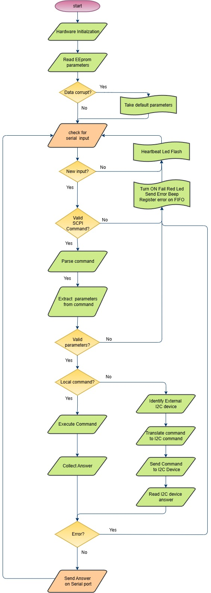

## Features

•	The Pico master firmware is the main controller of the interconnect IO Box.  The Master receive SCPI command from serial port, execute the command and return the answer.  
•	The Pico Master device is used to control the Interconnect IO Board and handle the communication protocols available on the board (I2C, SPI, Serial, and 1-Wire).   
•	SCPI commands supported by the Pico master firmware are listed in the GitHub repository InterconnectIO_Master. For details, refer to the <a href= "https://github.com/dlock8/InterconnectIO_Master/blob/main/README.md">readme.md</a> 
•	Thanks to the open-source SCPI device library written by Jan Breuer, available at  <a href= "https://www.jaybee.cz/scpi-parser/">SCPI parser</a> 
•	Detailed messages to aid in debugging or understanding the process flow are available through the USB connector of the Pico controller. 
•	The configuration EEPROM is used to store user preferences. 
•	On error, the 'Red Fail' LED on the front panel will turn ON, and a beep will sound for a short duration. 
•	The Master firmware needs to be loaded onto the Pico controller and installed at the location marked in the picture above.  

## Flowchart

•	The flowchart below illustrates the algorithm used to process SCPI commands received on the serial port. 

<figure>
  
  <figcaption>Master Firmware Flowchart</figcaption>
</figure>

{: .t60 }


