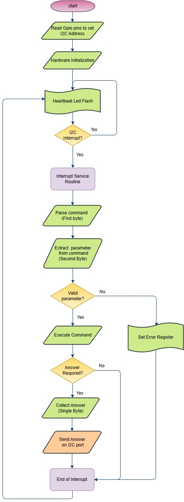

## Features
•	The Pico slave firmware acts as the I2C slave controller for the Interconnect IO Box. The Pico slave receives 2 bytes of information (command + parameters) from the Master Pico, processes the command, and returns an answer if necessary. 
•	The Pico slave devices are used to perform only basic GPIO actions, which do not require speed. 
•	Commands supported by the Pico slave firmware are listed in the GitHub repository InterconnectIO_Slave. For details, refer to the <a href= "https://github.com/dlock8/InterconnectIO_Slave/blob/main/README.md">readme.md</a> 
•	The I2C addresses used to communicate with the Pico slaves are defined by two hardware lines connected to ground (0) or left open (1).  
•	The slave firmware needs to be loaded onto the three Pico controllers and installed at the location marked in the picture above.  

## Flowchart

•	The flowchart below illustrates the algorithm used to process commands received from the Master Pico on the I2C port. 

<figure>
  
  <figcaption>Slave Firmware Flowchart</figcaption>
</figure>

{: .t60 }


