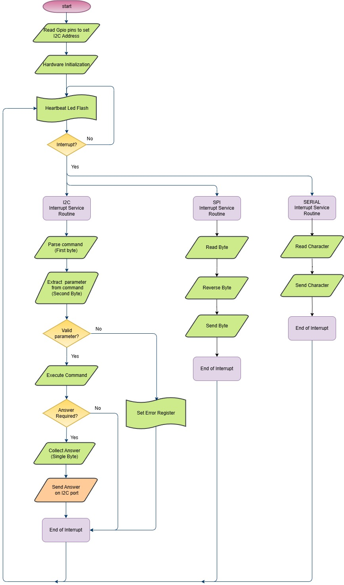

## Features

•	The Seftest firmware is the controller of the Selftest Board.  The device receive I2C command from Interconnect IO Box, execute the command and return the answer.  
•	The Selftest code firmware is used mainly to verify the communication protocols available on the Interconnect IO Box (I2C, SPI and Serial).  
•	Commands supported by the Pico Selftest firmware are listed in the GitHub repository Selftest_code. For details, refer to the <a href= "https://github.com/dlock8/Selftest_code/blob/main/README.md">readme.md</a> 
•	The I2C addresses used to communicate with the Pico Selftest are defined by two hardware lines connected to ground (0) or left open (1). 
•	The Selftest firmware needs to be loaded onto the Pico controllers and installed at the location marked in the picture above.  

## Flowchart

•	The flowchart below illustrates the algorithm used to process commands received from the Iterconnect IO Box  on the I2C port. 

<figure>
  
  <figcaption>Master Firmware Flowchart</figcaption>
</figure>

{: .t60 }


