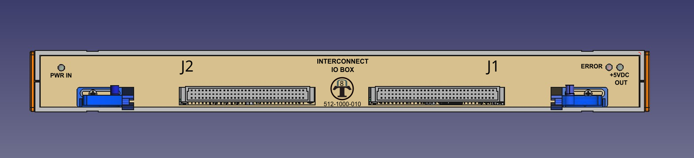

## Features

•	The front panel is laser-cut, and the text was added using Inkscape.  
•	The logo, "Dlock8 Test," was added to enhance the professional appearance.  

<figure>
  
  <figcaption>IO Box Front Panel</figcaption>
</figure>

•	The back panel is laser-cut, and the text was added using Inkscape.  
•	Maximum information has been added to the panel to ensure connections can be made without errors.  

<figure>
  
  <figcaption>IO Box Back Panel</figcaption>
</figure>

•   The Selftest board can be easily inserted into the Interconnect IO Box using the guided rails. 
•   The position of the guided rails is adjustable horizontally to accommodate shorter or larger boards. 
•   The Selftest board can be used as a template to create custom boards for testing new Units Under Test (UUTs).. 

<figure>
  
  <figcaption>IO Box with Selftest Board</figcaption>
</figure>

•   A custom cable harness could be connected to the Interconnect IO Box.  
•   A plan has been made to design a custom case for the connector, which can be produced using 3D printing.  

<figure>
  
  <figcaption>IO Box with harness cable</figcaption>
</figure>

•   Rackmount brackets are included with the Interconnect IO Box, making it compatible with a 19-inch rackmount cabinet. 

<figure>
  
  <figcaption>IO Box in rackmount configuration</figcaption>
</figure>

{: .t60 }


