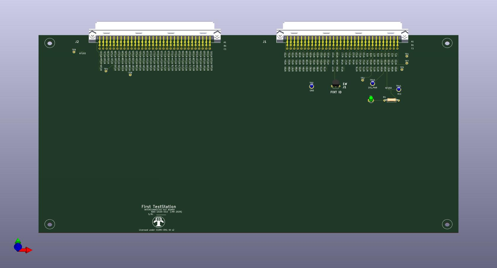
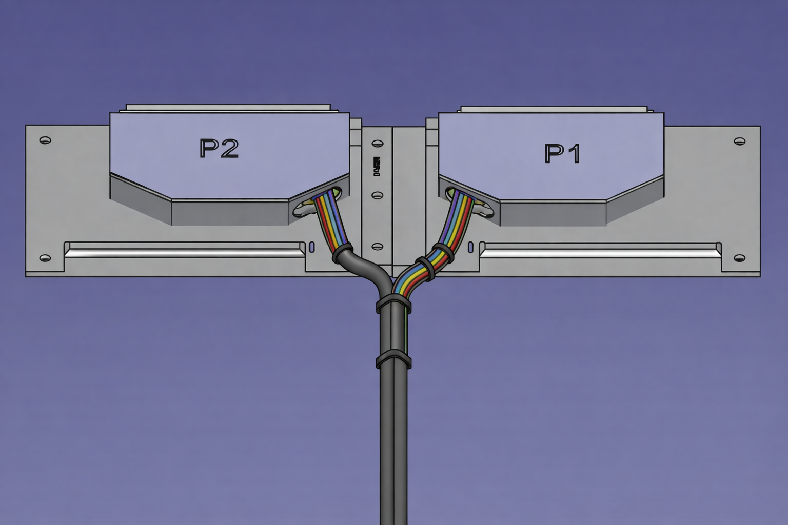
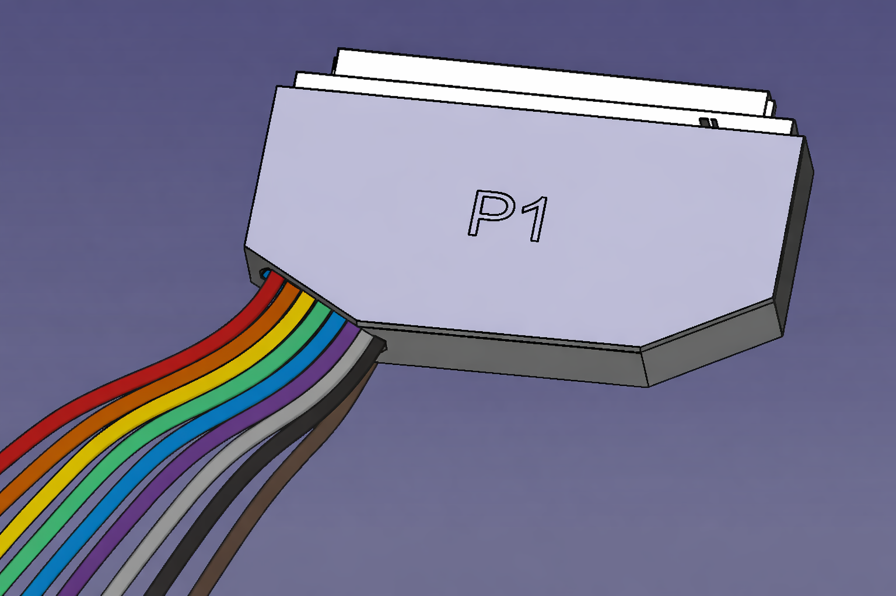
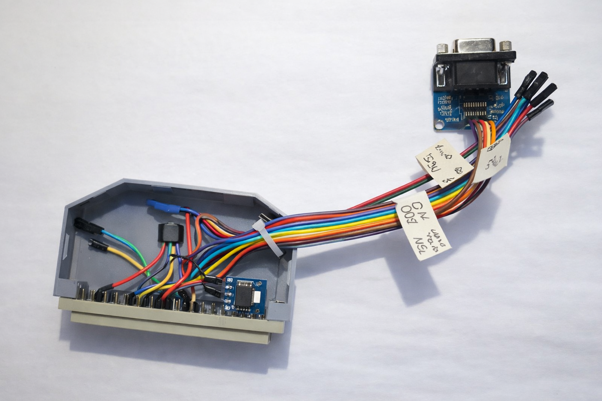

## Overview

To interface with a **Device Under Test (DUT)**, a custom connection must be built to bridge the DUT to the resources provided by the **First Test Station (FTS)**. This interface, commonly known as a **Fixture**, can take several formats depending on complexity. 

This page presents three standard fixture architectures used to connect a DUT to the InterconnectIO Box.

## Features

* **Full Compatibility:** Designed specifically for the InterconnectIO Box interface.
* **Fixture ID Support:** Dedicated physical space for installing Fixture ID identification devices.
* **Open Documentation:** Complete design files and guides to serve as a standardized starting point.
* **Version Controlled:** All designs are maintained and documented on GitHub repositories.

---

## DUT_Board

<figure>
  
  <figcaption>DUT Board Fixture</figcaption>
</figure>

The **DUT_Board** solution utilizes PCB-based interface boards. These are essential when signal conditioning, specialized routing, or active electronics are required between the InterconnectIO system and the DUT.

### Features

- **Plug-and-play compatibility** with InterconnectIO Box
- **Standardized connector footprints** for reliable interconnection
- **Reference design files** including schematics and PCB layouts (KiCad)
- **Mounting hole patterns** for secure mechanical attachment
- **Example implementations** to accelerate development

### Typical Use Cases
* Signal buffering and level shifting.
* Power conditioning and protection circuitry.
* High-density signal routing.
* Standardizing interfaces across multiple test platforms.
* Complex DUT test fixtures requiring active components.

> **Expert Note:** In many cases, a custom DUT Board is used to integrate specific electronics not natively available on the First TestStation. To achieve the highest reliability, it is ideal to mount the DUT connector directly onto the DUT Board Fixture. This "wireless" approach eliminates floating cables and significantly improves signal integrity and durability. Utilizing our pre-developed PCB templates can drastically reduce design time for these fixtures.

---

## DUT_Cable_Board

<figure>
  
  <figcaption>DUT Cable Board Fixture</figcaption>
</figure>

The **DUT_Cable_Board** consists of 3D-printed mechanical wiring platforms. These replace traditional PCBs when active electronics are not required. Instead of copper traces, discrete wires and cable harnesses are used to route signals manually.

## Key Features
- **3D Printed Structure** – Allows for immediate iteration without PCB fabrication lead times.
- **Connector-Based Interface** – P1, P2 (or other connectors) are securely mounted on the board.
- **Cable Harness Routing** – Wires are logically routed and bundled, mimicking a physical layout.
- **Integrated Strain Relief** – Built-in tie-wrap points and mechanical guides to prevent cable stress.
- **Modular DUT Connection** – Easily adaptable for varying DUT geometries.
- **Fixture ID Ready** – Dedicated space near the primary connectors for ID device installation.

### Typical Use Cases
* Passive DUT fixtures requiring no active signal conditioning.
* Rapid prototyping and proof-of-concept hardware cycles.
* Manufacturing-grade cable harness routing and management.
* Modular platforms where wiring needs to be easily serviceable or reconfigurable.

> **Expert Note:** The DUT Cable Board was specifically designed to assist with the mechanical insertion and extraction of the fixture from the InterconnectIO Box. While using wires is a standard connection method, mounting those connectors to a rigid base board—similar to a PCB—dramatically improves long-term reliability. 
> 
> Furthermore, installing a **Fixture ID** device might seem like an extra step, but you will appreciate it the moment a DUT fails or a Test Station starts to smoke because the wrong fixture was plugged in. **Always verify your fixture electronically.**

---

## DUT_Cable

<figure>
  
  <figcaption>DUT Cable Fixture</figcaption>
</figure>

The **DUT_Cable** solution features minimal, single-connector cable harnesses. This is the most streamlined approach for DUTs requiring only a limited subset of signals, allowing you to bypass the complexity of the full InterconnectIO P1/P2 resource set.

## Key Features
- **Minimalist Footprint** – Reduced bulk for simple testing requirements.
- **Direct J1 Integration** – Optimized to utilize the primary J1 connector where specialized resources are concentrated.
- **High-Speed Prototyping** – No PCB fabrication or complex mechanical assembly required.
- **Strain Relief Management** – Uses mechanical guides and tie-wraps to ensure connection longevity.
- **Fixture ID Capability** – Sufficient space remains for electronic fixture identification.

### Typical Use Cases
* Low-complexity DUTs with minimal pin counts.
* Dedicated production test jigs for high-volume, simple devices.
* Early-stage development and benchtop debugging.
* Focused testing: Power-only, programming-only, or basic communication (UART/USB) interfaces.

> **Expert Note:** The DUT_Cable was specifically designed for scenarios where full station resources are overkill. We strategically grouped the most critical special features onto the **J1 connector** of the InterconnectIO Box. This allows for a "single-connector" interface if you only need to program a DUT or perform basic digital communication. In fact, the DUT_Cable was the primary tool used to validate I2C, SPI, and Serial communication during the initial development of the InterconnectIO Box itself.

---
---

# FTS Communication Fixture: A True Application Example

<figure>
  
  <figcaption>Communication Fixture</figcaption>
</figure>

The **FTS Communication Fixture** was designed and used as a real-world application to validate the communication protocols available on the **InterconnectIO Box**.

## 🛠️ Key Features

- **J1-Focused Design:** Optimized to utilize the high-density digital resources available on the InterconnectIO **J1** port.  
- **Protocol Support:** Dedicated signal routing for **I2C (SDA/SCL)**, **SPI (MOSI/MISO/SCK/CS)**, and **UART (RX/TX/CTS/RTS)**.  
- **3D Printed Chassis:** Rapidly deployable mechanical enclosure with integrated cable strain relief.  
- **Electronic Fixture ID:** Integrated Fixture Identification device to prevent incorrect hardware assignment during automated testing.

> **Expert Note:**  
> The I2C and SPI protocols were validated using external sensor modules connected via individual flying wires.  
> Using single-wire connections for each signal ensures compatibility with different module pinouts without requiring fixture modifications.  
>  
> In this implementation, the **ADXL345 accelerometer module** was selected because it supports both **SPI and I2C**, making it ideal for dual-protocol validation.  
> The corresponding OpenTAP test plans are available in the project **FTS Resources Repository**.

{: .t60 }
