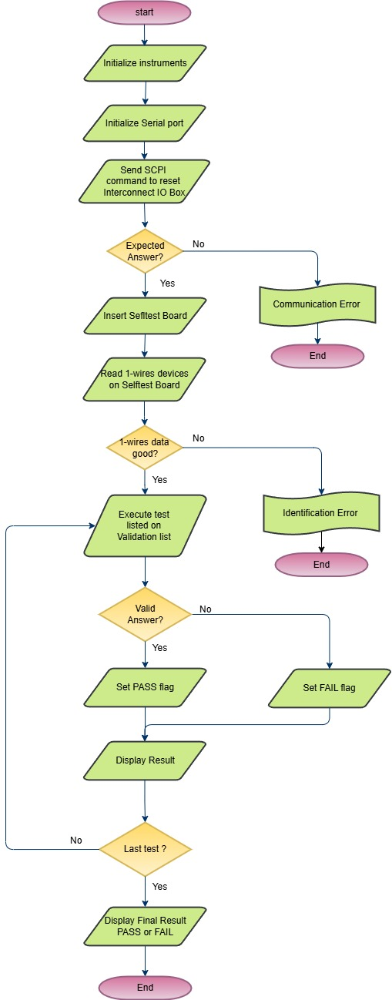

---
## Features

•   On the First TestStation (FTS), the plan was always to design the InterconnectIO Box coupled with the Selftest Board to ensure that the hardware operates as intended and the firmware functions as expected, with minimal bugs. 
•   The test sequence for validating the First TestStation was developed following the creation of the Selftest Block Diagram to ensure that the maximum number of hardware components and functionalities are covered in the Test Validation list. 
•	The Test Validation sequence are part of the InterconnectIO Box in the github repository.  For details, refer to the <a href= "https://github.com/FirstTestStation/InterconnectIO_Box/tree/main/pdf/Test_Validation.pdf">Test Validation.pdf</a> 
•   The Test Sequence has been integrated into the InterconnectIO Box in a built-in format to facilitate the validation and debugging of both the hardware and firmware.  
•   The design plan is to utilize the <a href= "https://opentap.io/">OpenTAP environment</a> to transition the built-in Selftest functionality to an external test sequencer. 

## Flowchart

•	The flowchart below illustrates the algorithm used to validate the test procedures of the First TestStation. 

<figure>
  
  <figcaption>Test Sequence Flowchart</figcaption>
</figure>

{: .t60 }


