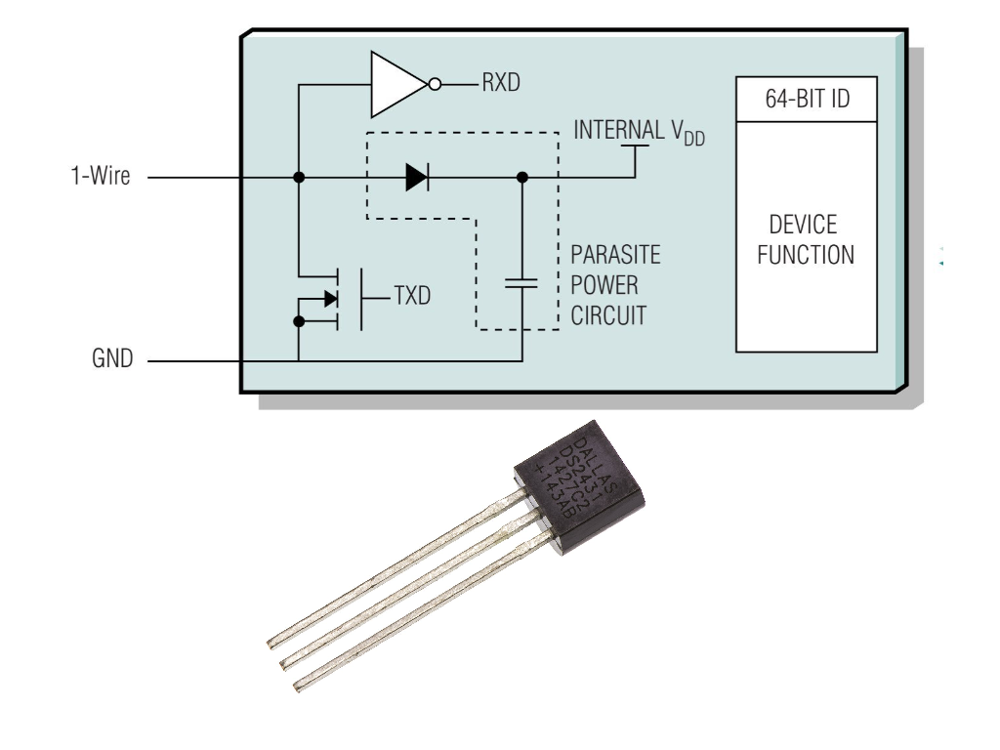
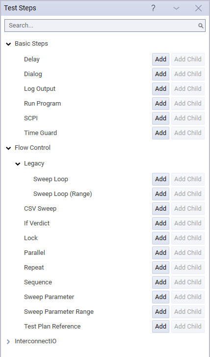
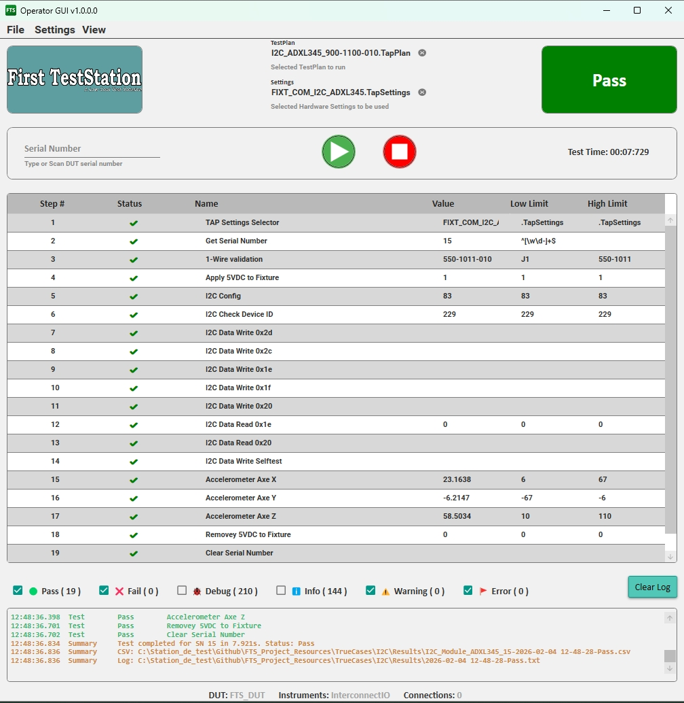

---

A comprehensive collection of examples, documentation, and best practices for developing **production-ready test sequences** on the **First TestStation (FTS)** platform using **OpenTAP**.

These resources are designed to shorten the learning curve—from basic OpenTAP test step validation to complete, real-world production test implementations with intelligent fixture design.

Whether you are new to OpenTAP or an experienced test engineer, this repository provides practical, working examples that reflect real manufacturing constraints.

---

## What You’ll Find Here

- Ready-to-use OpenTAP test plans
- Hardware–software integration examples
- Intelligent fixture concepts
- Best practices for production test development
- Training material for new test engineers and operators

---

### Fixture Identification

Correct identification of fixtures, cables, and interface equipment is critical in a production test environment. To prevent operator errors and protect both the **First TestStation (FTS)** and the **Device Under Test (DUT)**, the FTS platform supports the use of **1-Wire EEPROM devices**.

A 1-Wire device is compact (typically available in a **TO-92 package**) and can be easily integrated into any fixture, cable assembly, or interface module located between the FTS and the DUT.

When the 1-Wire device is programmed with identification data—such as the **fixture name** and **fixture identifier**—the test plan can automatically read and validate this information at the start of execution. If the detected fixture does not match the expected configuration, test execution is **immediately stopped** and **no power is applied** to the DUT. This protects both the test station and the DUT from incorrect connections.

This approach implements a **hardware–software interlock**, which is essential for safe, repeatable, and production-ready test systems.

#### Why 1-Wire in FTS
- **Automatic Identification** – Each device has a factory-programmed unique 64-bit ID. 
- **Minimal Wiring** – Requires only one data line plus ground.  
- **Plug-and-Play** – No addressing, jumpers, or manual configuration  
- **Low Cost** – Widely available devices (e.g., DS2431 in TO-92 package)  
- **Error Prevention** – Ensures the correct fixture is connected before applying power to the DUT  
- **Data Collection** – The data read on "1-wire" is part of the information saved on each DUT to help with analysis

In a special case, the 1-Wire device could be used not to identify the fixture but to identify the Selftest Board. In this case, the information read on the "1-wire" sets the values for DUT Name, DUT Number, and DUT SerialNumber instead of Fixture Name, Fixture Number, and Fixture SerialNumber.

## Technical Articles

<figure>
  
  <figcaption>1-Wire Device</figcaption>
</figure>

-**Overview of 1-Wire Technology and Its Use** [1-Wire Technology](https://www.analog.com/en/resources/technical-articles/guide-to-1wire-communication.html)

---
---

### TestCases  

A collection of **simple, focused OpenTAP test cases** designed to validate the FTS Operator GUI and demonstrate standard OpenTAP test steps.

Created to understand how Test Step coming with OpenTAP work in creation of test sequences, the test steps are also be used to validate the execution on the FTS Operator GUI

<figure>
  
  <figcaption>OpenTap Test Steps</figcaption>
</figure>

#### Typical Use Case
- Validate FTS Operator GUI installation  
- Train new users on OpenTAP functionality  
- Provide reference implementations for production test flows  

The Test Steps has been divided in Four Main categories:

**1. Basic Steps**
- Dialog, Delay, Log Output, Time Guard, Run Program  
- No hardware required  
- Demonstrates all verdict types: Pass, Fail, Error, Abort, Inconclusive  

**2. Flow Control**  
- Repeat, If Verdict, Parallel, Sequence, Lock  
- External Test Plan references  
- Demonstrates conditional execution and timing dependencies  

**3. Sweep Flow Control**  
- Sweep Loop, Sweep Range, CSV Sweep, Sweep Parameter  
- Requires OpenTAP Demonstration plugin  
- Simulated battery testing and temperature chamber examples  

**4. InterconnectIO Examples**  
- Validation of the FTS_InterconnectIOBox plugin  
- System version, firmware, configuration, and SCPI command tests  
- Requires only the InterconnectIO Box (no DUT required)

---
---

### TrueCases

The TrueCases is a complete example of test implementation for a particular DUT (ADXL345) on the FTS TestStation.

In this example, the goal was to validate the I2C and SPI communication using a simple commercial module.

Two test sequences have been created and validated on FTS: the I2C test sequence and the SPI test sequence.

Pictures below show the fixture and I2C test sequences used to validate the DUT module.

<figure>
  
  <figcaption>Communication Fixture</figcaption>
</figure>

<figure>
  
  <figcaption>I2C TapPlan</figcaption>
</figure>

### Key Features

- Ready-to-run TapPlan files
  - `900-1100-010` – I²C test sequence
  - `900-1101-010` – SPI test sequence
- Preconfigured TapSettings files
- Execution logs with pass/fail examples

---

## Resource Location

The resources are hosted on the official GitHub repository.

🔗 [FTS Project Resources](https://github.com/FirstTestStation/FTS_Project_Resources)

{: .t60 }


